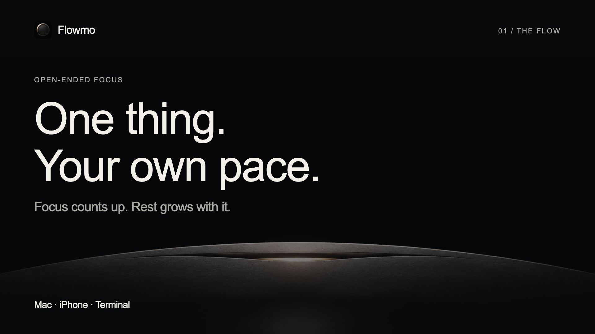
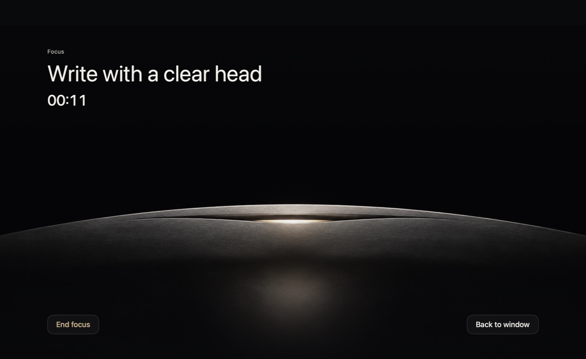
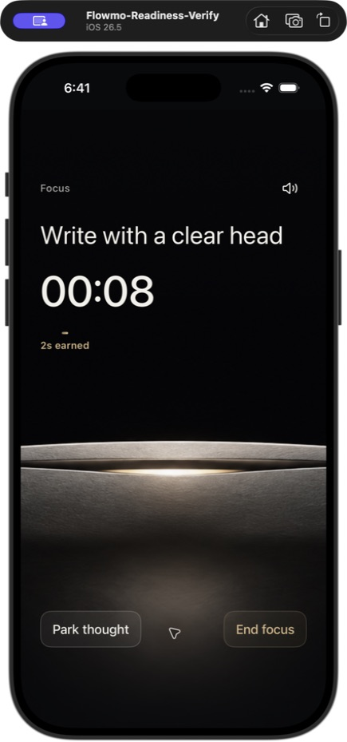
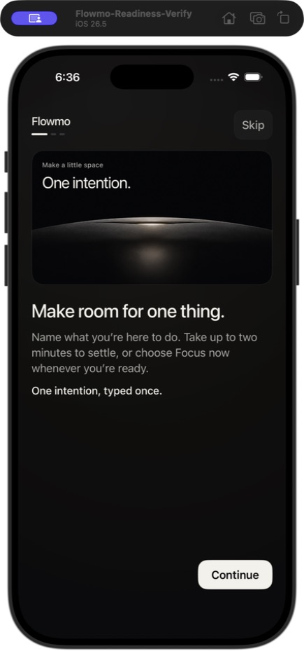

# Flowmo

**Focus until you're ready to stop. Let your break grow with you.**

Flowmo is a Flowmodoro for Mac, iPhone, and the Mac terminal. Set an intention,
work with an open-ended count-up clock, take the rest you earned, and leave a
clear next step for later. No fixed Focus deadline, scores, or streaks.

The Mac window is the main product, with a menu-bar clock and an optional
Distant Horizon Focus scene. iPhone runs the same loop in a native interface.
The terminal controls and displays the same local session as the Mac app.

**Public preview:** [Flowmo 1.0, build 6](https://github.com/francarraras/flowmo-dev/releases/tag/v1.0.0-preview.6)
is available for Mac and the terminal. Read its known verification limits before
installing; this is a preview, not a fully verified production release. The
working name is Flowmo, and the source uses the [MIT license](LICENSE).

[](https://github.com/francarraras/flowmo-dev/releases/download/v1.0.0-preview.6/GithubExplainer.mp4)

[Watch the flow in 25 seconds](https://github.com/francarraras/flowmo-dev/releases/download/v1.0.0-preview.6/GithubExplainer.mp4) · [Tutorial cards](docs/media/README.md)



<p>
  
  
</p>

Native Mac and iPhone Simulator captures with synthetic example text.
[Screenshot provenance](PROVENANCE.md#documentation-screenshots).

## Get Flowmo

| Platform | Installation | Requirements |
| --- | --- | --- |
| Mac app | Reviewed Mac ZIP from this repository's [Releases](https://github.com/francarraras/flowmo-dev/releases); [source build](#run-from-source) is available now. | macOS 14+, Apple silicon or Intel |
| Mac terminal | Separate universal CLI archive and installer from the same release, or [build and install locally](#install-the-terminal-command). | macOS 14+, Apple silicon or Intel |
| iPhone | [Build FlowmoPhoneLocal in Xcode](#iphone-with-xcode) with your free Personal Team. | iOS 17+, a Mac with Xcode, your Apple Account |

No paid Apple Developer membership is needed for the chosen path. Mac packages
are ad-hoc signed and **not notarized**. iPhone installation is personal testing
through Xcode; there is no general-download IPA or App Store requirement.
Windows, Android, iCloud sync, and a Home Screen widget are outside this release.

### Mac download

Download the preview’s Mac `.zip` and matching
`.sha256` file from the same release. In the folder containing both, verify the
checksum using its actual filename:

```bash
shasum -a 256 -c NAME.zip.sha256
```

Open the ZIP, read **READ ME FIRST.txt**, and move **Flowmo.app** to Applications.
If macOS blocks this non-notarized build and you trust the release source, use
Apple's per-app **System Settings → Privacy & Security → Open Anyway** flow
after trying to open it. Never disable Gatekeeper or remove quarantine. If
macOS reports damage or malware, stop and report the problem. See
[Apple's opening instructions](https://support.apple.com/102445).

## The loop

1. **Intention:** write what you want to work on, then Start.
2. **Prepare:** take up to two minutes to settle in, or choose Focus now.
3. **Focus:** the clock counts up until you choose End focus. Park a thought
   without leaving the session. Gold shows the rest you have earned.
4. **Break:** rest in proportion to your Focus time. Choose Reflect when ready.
5. **Reflection:** write where you will pick up next, or use a parked thought.
6. **Finish:** review the session. Done carries its next step into editable Idle;
   starting another session is always your choice.

There is no Pause during Focus. After quit, crash, or sleep recovery, Continue
resumes the frozen phase and Restart begins preparation again. Opening the app
never resumes a recovery-paused session automatically.

On Mac, **Focus scene** opens a movable, resizable horizon canvas. **Back to
window** restores Classic or Mini while the same Focus keeps counting. On
iPhone, the horizon is the active Focus screen. Flowmo Local also adds a
Focus count-up reminder on the Lock Screen and supported Dynamic
Island. Tap it to return to the app; it has no session controls. History is a
simple list of completed sessions from which you can restore a next step or
intention.

## Run from source

You need a Mac running **macOS 14 or newer** and Xcode with **Swift 6 or newer**.
Run these commands from the repository root; the included license describes
source use and redistribution rights.

To open the Mac window immediately:

```bash
swift run flowmo
```

To build the Dock app in local-only mode:

```bash
xcodebuild -project Apps/Flowmo.xcodeproj -scheme Flowmo -configuration Release -derivedDataPath .build/mac CODE_SIGN_IDENTITY=- CODE_SIGN_ENTITLEMENTS= AD_HOC_CODE_SIGNING_ALLOWED=YES build
open .build/mac/Build/Products/Release/Flowmo.app
```

## iPhone with Xcode

1. Open `Apps/FlowmoPhone.xcodeproj` in Xcode and select **FlowmoPhoneLocal**.
2. Connect and unlock your iPhone. Sign into your Apple Account in Xcode and
   select its **Personal Team** for both **FlowmoPhoneLocal** and
   **FlowmoFocusActivity** under Signing & Capabilities.
3. Select the iPhone as the run destination and Run. Complete device trust and
   Developer Mode prompts if needed. If a bundle identifier is unavailable,
   choose a unique app identifier and keep the extension identifier prefixed
   by it. The scheme also runs in the simulator without device provisioning.

This separate local app keeps the focus loop, recovery, exports, and local
reminders. Its data stays in its own app container; it has no iCloud sync or
Home Screen widget and does not import the entitled app's data. Its separate
Live Activity extension receives only the session identifier and Focus start
time, never your written text. It can start only while the app is foreground;
after Prime ends in the background, open the app to begin the reminder. iOS
controls its placement and duration. See [Focus Live Activity](docs/iphone.md#focus-live-activity).
The phone app currently supports portrait only. Apple's free provisioning
expires after **seven days**, requiring rebuilding/reinstalling over the app.
Reinstall over the existing app to preserve its container; deleting the app
deletes its local data, so export first when you need to keep it.
See [personal testing and installation](docs/release.md#free-personal-testing).

The existing **FlowmoPhone** scheme retains the App Group, CloudKit, push, and
widget capabilities for eligible teams. Neither a simulator build nor a plain
GitHub IPA is a public iPhone installation route.

## Install the terminal command

Build once and install into your own `~/.local/bin`:

```bash
swift build -c release --product flowmo
./Scripts/install-cli --binary "$(swift build -c release --show-bin-path)/flowmo"
export PATH="$HOME/.local/bin:$PATH"
flowmo --version
```

Add the PATH line to your shell configuration to keep it in new terminals.
The source-build command above selects the executable from SwiftPM's output
directory, where its `flowmo_FlowmoLook.bundle` artwork must remain beside it.
The installer copies both into `~/.local/libexec/flowmo` and creates the
`~/.local/bin/flowmo` launcher. It does not change your shell configuration or
session data, or replace an existing installation without `--replace`.

For a reviewed CLI download, choose the separate `macOS-universal-cli.tar.gz`
archive and its `.sha256` file from the same
[Release](https://github.com/francarraras/flowmo-dev/releases).
Verify the archive before extracting it, using the actual filenames:

```bash
shasum -a 256 -c NAME.tar.gz.sha256
tar -xzf NAME.tar.gz
```

From the extracted folder, run `./install.sh` and follow its PATH instruction.
The installer checks the complete executable/artwork payload before changing
an installation. Archives marked **DIRTY / DO NOT DISTRIBUTE** are engineering
checks and are not release downloads. Current CLI packages are ad-hoc signed
and not notarized; follow the same macOS limitations as the app download. If
macOS will not allow the executable, use a source build or report the issue;
never disable security settings or remove quarantine.

## Use the terminal

```bash
flowmo start "write the next section"  # Prepare
flowmo skip                           # Enter Focus
flowmo capture "check this later"     # Park a thought
flowmo live                           # Watch the clock; q leaves this view
flowmo stop                           # Earned Break
flowmo skip                           # Reflection
flowmo recall "continue with examples"
flowmo skip                           # Session summary
flowmo skip                           # Finish and return to Idle
flowmo status
```

Run `flowmo --help` for commands, or `flowmo start --help` for usage without
starting. With no arguments, `flowmo` opens a Mac window. `continue` and
`restart` are recovery actions; there is no Focus pause command.

The CLI and Mac app share one local session. Their store is internal storage,
not a supported write API. Use CLI commands for automation instead of editing
JSON files. Terminal session text can enter your shell history; use the window
when you prefer not to put an intention in a command.

### Automation

`flowmo status --json` returns `schemaVersion: 1`, `generatedAt`, and `status`.
Supported action commands accept `--json` and return a structured success/error
envelope. Action responses do not echo intention, capture, or Reflection text;
the status response includes private session text when present. Unknown commands
and unsupported options fail without opening a window or performing an action.

## Updates and removal

Quit running Flowmo terminal/window instances before upgrading.
Rebuild with the source-install instructions above and add `--replace` to the
installer command. For a packaged CLI upgrade, use `./install.sh --replace`.
`--upgrade` is an equivalent option. Upgrades accept an older regular executable
or a launcher made by this installer, install a complete new binary/artwork
payload, then switch the launcher atomically. Previous payloads are retained.
For a Mac app upgrade, replace Flowmo.app in Applications after quitting it.
Updates preserve session data; there is no automatic updater yet.

To uninstall the default terminal command, remove its launcher:

```bash
rm "$HOME/.local/bin/flowmo"
```

You may then remove the installer-owned `~/.local/libexec/flowmo` directory to
reclaim its binaries and artwork. For a custom `--prefix`, use `bin/flowmo` and
`libexec/flowmo` beneath that prefix instead. These locations contain no session
data. Move Flowmo.app to Trash to remove the Dock app. To remove session data as
well, use **Data → Delete All Data** while Idle before uninstalling. Entitled sync builds
also request deletion from private iCloud; offline deletion remains incomplete
until the cloud confirms it. Review the confirmation before proceeding.

## Privacy and sync

There is no Flowmo server, advertising, or third-party analytics SDK. Mac and
iPhone offer redacted diagnostics, full-data export, and confirmed deletion.
Full exports contain private text and should not be attached to public issues.

Appropriately signed Mac and iPhone apps can synchronize through the user's
private CloudKit database. Both work locally when iCloud is unavailable;
incompatible live sessions require an explicit choice. The local Mac preview
and CLI carry no CloudKit entitlement. CLI changes synchronize only when an
entitled Mac app observes the shared store. The phone widget is a read-only
glance at the phone's local copy.

Read the [privacy policy](PRIVACY.md) and [security-reporting policy](SECURITY.md).

## Feedback and known limits

Use this repository's [bug-report form](https://github.com/francarraras/flowmo-dev/issues/new?template=bug-report.yml)
for reproducible non-sensitive problems when Issues are available. Include the
build or commit, device/OS, installation route, and steps with synthetic text.
Review screenshots and redacted diagnostics before attaching them. Never post
a full export, personal intention, parked thought, store path, or account data.
For vulnerabilities or sensitive privacy reports, follow [SECURITY.md](SECURITY.md)
instead. During local testing, you can also use the private channel through
which you received the build. No public email or donation destination has been
configured.

- Mac and terminal share a store; Flowmo Local on iPhone keeps an independent
  store. These local packages do not sync between devices.
- iPhone is portrait-only. Live Activities depend on iOS permission, placement,
  duration, and device support; a background transition into Focus needs the
  app reopened before its Live Activity can start.
- macOS download approval, free iPhone profile renewal, and optional system
  permissions are part of installation. There is no automatic updater.
- Native and simulated checks cover the main loop. Release notes must identify
  any remaining physical-device, VoiceOver, or supported-OS checks; screenshots
  and a successful build are not proof of every device configuration.

## Development and release checks

```bash
swift format lint --strict --recursive Package.swift Sources Tests Apps
swift test -Xswiftc -warnings-as-errors
swift run -Xswiftc -warnings-as-errors flowmo check
swift build -c release -Xswiftc -warnings-as-errors
```

These are development checks, not the complete candidate gate. Follow the
[release procedure](docs/release.md) for platform analysis, manual smoke,
signing, and packaging. `Scripts/package-cli` creates a local universal CLI
archive; `Scripts/family-preview` prepares the reviewed Mac preview. Neither
publishes a release.

For implementation work, read [terms](CONTEXT.md), [product behavior](docs/PROJECT.md),
[architecture](docs/architecture.md), and the [feature/proof map](docs/feature-map.md).
The [visual contract](docs/visual.md), [Focus Guard](docs/focus-guard.md),
[menu-bar clock](docs/menu-bar.md), and [terminal view](docs/live.md) describe
their respective behavior. `swift run flowmo-wp3-gate --help` opens the optional
local Focus Guard field-audit evaluator.
