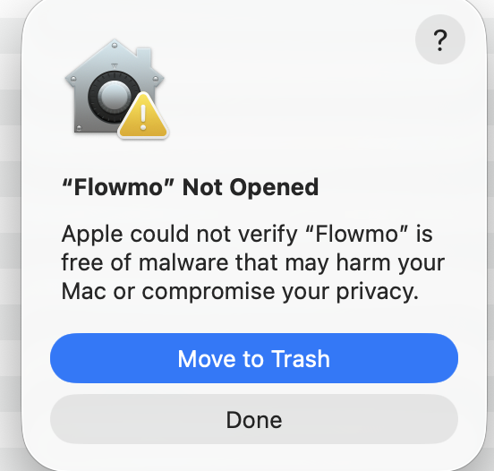

# Install Flowmo

Flowmo runs on macOS 14+ and iOS 17+. The Mac and terminal downloads support Apple silicon and Intel. The iPhone app requires a Mac with Xcode for installation.

## Mac

Download the Mac ZIP and its checksum from [Releases](https://github.com/francarraras/flowmo-dev/releases). Verify the download with `shasum -a 256 -c NAME.zip.sha256`, using its actual filename. Unzip it and move **Flowmo.app** to Applications.

### First launch on Mac

The preview is not notarized by Apple. The **“Flowmo” Not Opened** warning below means Apple could not verify the app; it is not a report that malware was detected. Only proceed if you downloaded Flowmo from **[this repository’s releases](https://github.com/francarraras/flowmo-dev/releases)** and trust the download.



1. Open **Flowmo.app** from Applications. If you see **“Flowmo” Not Opened**, click **Done**.
2. Go to **System Settings → Privacy & Security**, scroll down, and click **Open Anyway** beside the Flowmo warning.
3. Authenticate if asked, then confirm **Open**. After this, launch Flowmo normally.

**Can’t find Open Anyway?** Try opening Flowmo once more, dismiss the warning with **Done**, then return to Privacy & Security. A managed work or school Mac may require help from its administrator.

These steps follow [Apple’s opening instructions](https://support.apple.com/en-us/102445). If the message instead says the app **will damage your computer** or **is damaged**, stop and [report the problem](https://github.com/francarraras/flowmo-dev/issues/new?template=bug-report.yml).


## Terminal download

Download the `macOS-universal-cli.tar.gz` archive and its checksum from the same release. Verify and extract it, then run `./install.sh` from the extracted folder. The installer checks the executable and artwork before installing them.

The command is installed in `~/.local/bin`. If that directory is not on your PATH, add this to your shell configuration:

```sh
export PATH="$HOME/.local/bin:$PATH"
```

Run `flowmo --version` to check the installation. Run `flowmo` to open the Mac window, or `flowmo live` for the terminal view.

## iPhone with Xcode

1. Open `Apps/FlowmoPhone.xcodeproj` in Xcode and select **FlowmoPhoneLocal**.
2. Connect your iPhone. Sign into your Apple Account in Xcode and select your **Personal Team** for **FlowmoPhoneLocal** and **FlowmoFocusActivity** under Signing & Capabilities.
3. Select your iPhone as the destination and Run. Follow the device trust and Developer Mode prompts. If needed, choose a unique app bundle identifier and an extension identifier prefixed by it.

A free Apple Account works; no paid developer membership is required. Free signing expires after seven days. Rebuild and install over the existing app to refresh it. Deleting the app also deletes its local data, so export anything you want to keep first.

The iPhone app supports portrait orientation. Sessions stay on the phone and do not sync with the Mac downloads. The local scheme includes the Focus Live Activity, but no Home Screen widget. There is no general-installation IPA.

## Build from source

Install Xcode with Swift 6 or newer. From the repository root:

```sh
swift run flowmo
```

For an installable Mac app:

```sh
xcodebuild -project Apps/Flowmo.xcodeproj -scheme Flowmo -configuration Release -derivedDataPath .build/mac CODE_SIGN_IDENTITY=- CODE_SIGN_ENTITLEMENTS= AD_HOC_CODE_SIGNING_ALLOWED=YES build
open .build/mac/Build/Products/Release/Flowmo.app
```

To build and install the terminal command:

```sh
swift build -c release --product flowmo
./Scripts/install-cli --binary "$(swift build -c release --show-bin-path)/flowmo"
```

Keep the artwork bundle beside the source-built executable until installation. The installer copies both into `~/.local/libexec/flowmo` and creates the launcher in `~/.local/bin`.

## Updates

Quit Flowmo before updating. Replace the Mac app in Applications. For the terminal download, run `./install.sh --replace` from the new archive; for a source build, add `--replace` to `Scripts/install-cli`. The installer retains previous payloads and preserves session data. There is no automatic updater.

## Removal

Move the Mac app to Trash. Remove `~/.local/bin/flowmo` to uninstall the terminal command; `~/.local/libexec/flowmo` contains its retained executables and artwork and can then be removed too. A custom installation uses the equivalent paths under its prefix.

These steps do not remove Mac session data. To delete it, choose **Data → Delete All Data** while Idle before uninstalling.
