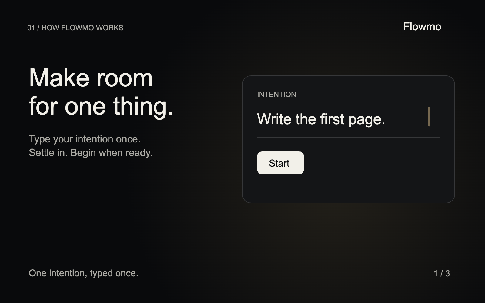
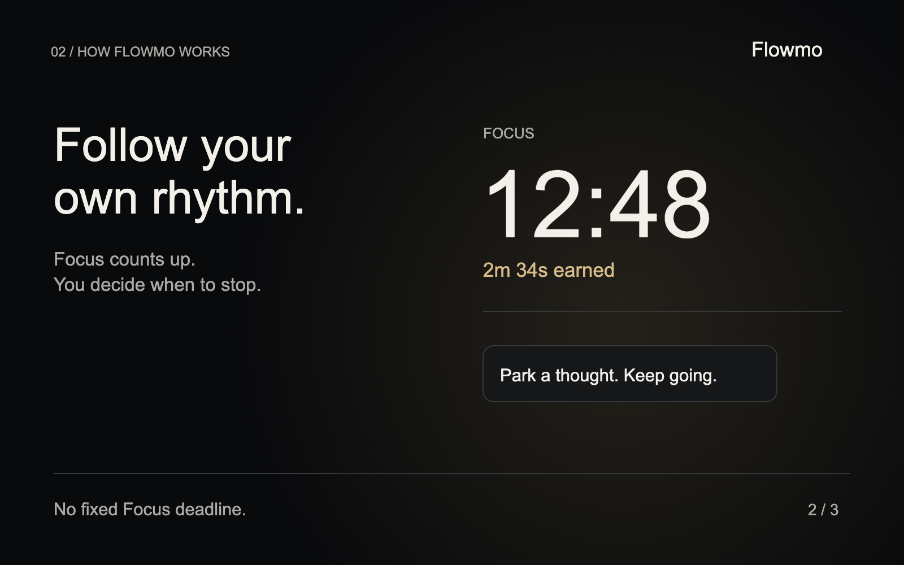
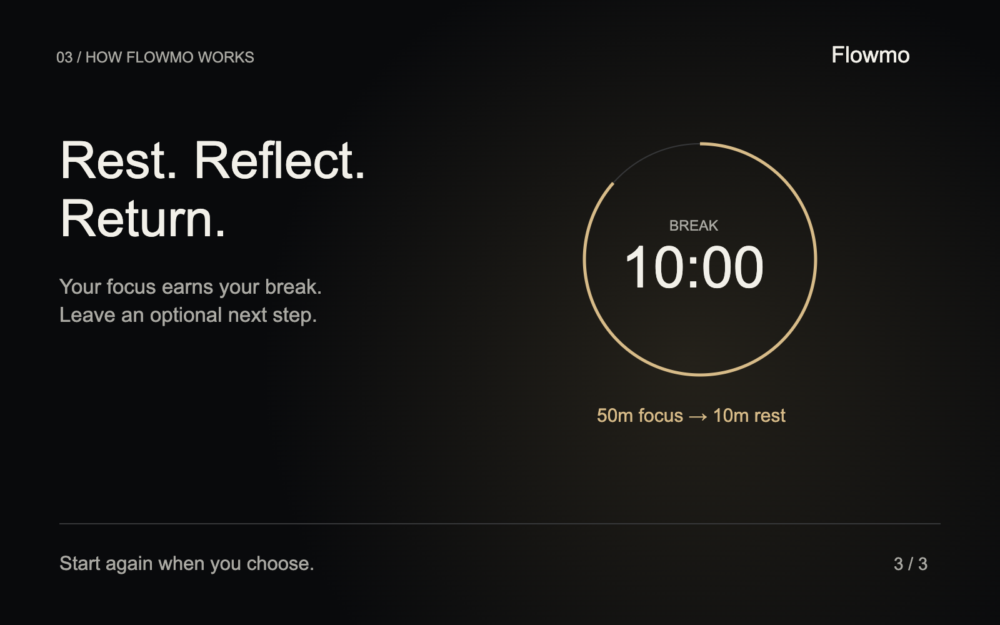

# How Flowmo works

Set one intention. Let Focus count up. Take the break you earn.

https://github.com/user-attachments/assets/825c43f5-21b6-424b-bde2-2ae771d6c329

## 1. Make room for one thing

## 2. Follow your own rhythm

## 3. Rest. Reflect. Return.

[Get Flowmo](../../README.md#get-started) · [Installation guide](../installation.md)

Media downloads and credits

[Portrait video](https://github.com/francarraras/flowmo-dev/releases/download/v1.0.0-preview.6/XExplainer.mp4) · [Remotion source and media pack](https://github.com/francarraras/flowmo-dev/releases/download/v1.0.0-preview.6/Flowmo-launch-media.zip) · [Captions](captions.srt)

The film illustrates the default 5:1 focus-to-break ratio with condensed time. [Asset provenance](PROVENANCE.md) · [Third-party notices](THIRD_PARTY_NOTICES.md)

